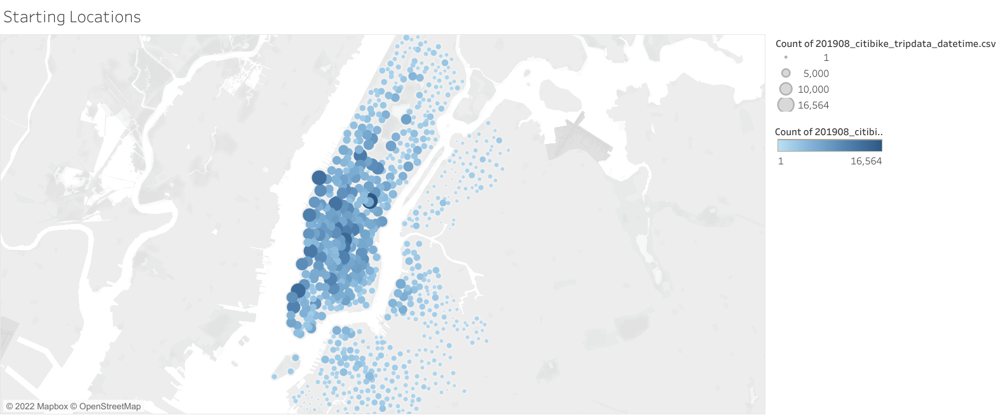
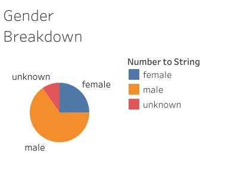
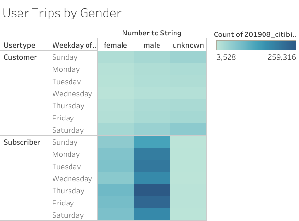
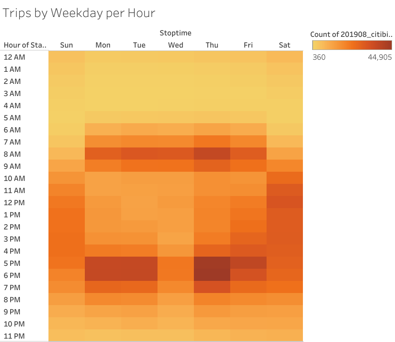
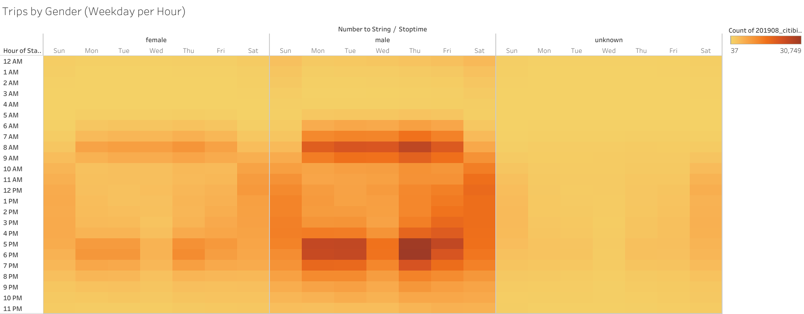
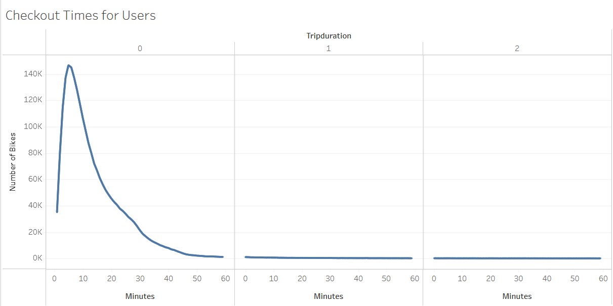
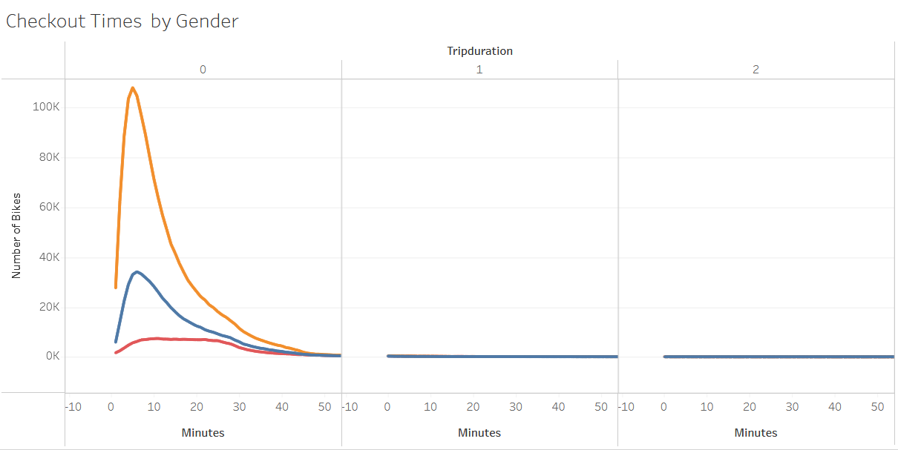

# Bike Sharing in Des Moines

## Overview
We performed a preliminary analtysis of CitiBike ride data, using specifically data from August of 2019 in New York City, New York, with the goal of evaluating whether a similar bike sharing business could take off in Des Moines, Iowa.  We uses New York, where Citi Bike was very successful, in a month where bike riding is common and convenient.  To begin, we tried to emphasize when people were riding, and what the userbase looked like.  This analysis is summarized in a [Tableau storyboard, here](https://public.tableau.com/shared/J8KDPTSXN?:display_count=n&:origin=viz_share_link), and further explained below.

## Results
<!-- Using the visualizations you have in your Tableau Story, describe the results of each visualization underneath the image. -->
#### Usage Locations

One point of interest we looked at was *where* these bikes were being used.  The image above shows where bikes were checked out from, with larger and darker circles representing more popular stations.  It is apparent that Manhattan saw the most use.  When determining viability in Des Moines, we should try to narrow in on what made Manhattan so popular, whether it be availability of bikes and bike routes, the potential destinations, limitations of other transit methods, or something else entirely.

#### The Userbase
Another focal point was user demographics.  We have so far focused on gender and subscription status.

Above is a pie chart depicting the reported genders of riders.  65.28% of riders reported themselves as male, 25.10% indentified as female, and 9.62% identified as 'other' or declined to report.

Here, we look at subscribers vs one-time customers and how Citi Bikes get used on different days of the week.  We see that male subscribers are responsible for the most rides, mostly Monday through Friday but with a good weekend turnout as well.  Customers who don't subscribe show a slight peak in weekend interest, especially when looking at those who didn't disclose their gender.

#### Peak Hours
Building from that last chart, we look further at *when* people use Citi Bikes.  

The chart above shows how many rides began each hour by weekday.  The darker spaces have higher traffic, and we can see that the busiest hours are 7-10 am and 4-8 pm, with a fair spread from around 10am to 8pm on weekends.  This lines up with a typical Monday-Friday 9-5 job commute, as well as recreational weekend rides.

Here we break the ride timing down by gender.  We see that males and females follow the same pattern as the previous chart, lining up with a typical work schedule, while unidentified riders frequent the weekends.

#### Ride Durations

Above is a simple line chart showing ride durations in minutes and hours.  A majority of trips appear to last half an hour or less, with a peak at 5 minute trips.  Moving forward, it would be important to look at what meaningful trips could be biked in similarly short times in Des Moines.

Finally, we break down ride duration by gender.  Male riders peak at 5 minute trips, with female ridership peaks at 6 minute trips.  Unidentified riders don't show such a defined peak duration, instead their trips tend to range between 5 and 30 minutes.

# Summary
<!-- Provide a high-level summary of the results and two additional visualizations that you would perform with the given dataset. -->
Overall, from just one month of data we are able to get an impressive overview of how Citi Bike works in NYC.  We can see that getting subscribers will be important, as they are responsible for most of the rides.  We also see that people tend to bike for short periods, and that traffic seems to line up with a 9-5 work commute.  We will need to investigate how that will translate in Des Moines, where residences are often more spread out.  For further confirmation that riders use Citi Bike to commute to work, we could look at ride durations by hour by weekday, in a similar way to our Trips by Weekday per Hour chart.  It would also be useful to look at roughly how far individual bikes travel to start predicting maintenance costs. Without knowing a specific route, this can be approximated based on trip duration per bike.  All said, our next goal is to begin looking at Des Moines and seeing how the city compares to what we've learned so far.
